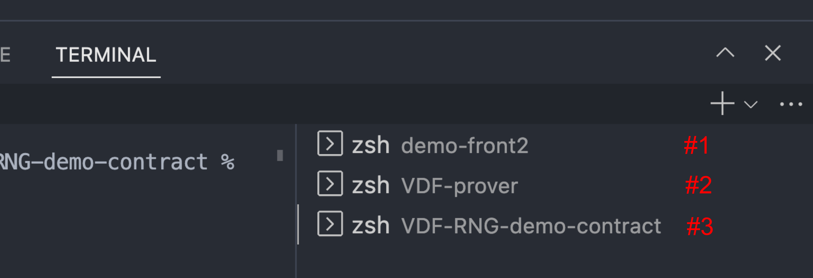

# Rnadomness Beacon

This repository is to construct a Distributd Randomness Beacon (DRB) using the Commit-Reveal-Recover scheme using timed commitments.
We used [Bicorn-RX](https://eprint.iacr.org/2023/221) mechanism for the overall protocol design.
And now, we're currently working on efficient VDF verification for the Recovery phase.
This [preprint](https://arxiv.org/abs/2405.06498) shows our interim rusults in on-chain Pietrzak VDF verification.


## Table of Contents

- [Introduction](#introduction)
- [Features](#features)
- [Installation](#installation)
- [Demo app](#demo-app)
- [Contributing](#contributing)
- [Contact](#contact)
- [License](#license)

## Introduction

Why Commit-Reveal-Recover Scheme and VDFs Matter? Generating random numbers on a blockchain requires mechanisms that ensure trustworthiness, fairness, and security. This is where the Commit-Reveal-Recover scheme and Verifiable Delay Functions (VDFs) play a crucial role. 

### 1. Trustworthy Randomness
- **Importance**: Ensuring a source of randomness that is impervious to manipulation or prediction by any participant is critical for applications like lotteries, gaming, or smart contract execution on a blockchain.

### 2. Commit-Reveal-Recover Scheme
- **Commit Phase**: Participants commit to a value secretly, typically via a hash of their secret number, preventing post-hoc changes.
- **Reveal Phase**: Participants reveal their secret numbers, and the final random number is derived from these.
- **Recover Phase**: Ensures the random number generation process can continue even if a participant fails to reveal their number, maintaining integrity.

### 3. Role of Verifiable Delay Functions (VDFs)
- **Time-locking**: VDFs impose a known and significant computational time delay, deterring manipulation attempts in the commit phase.
- **Unpredictability and Verifiability**: Adds an element of secure unpredictability and verifiability, crucial for fairness in decentralized environments.

### 4. Enhancing Security and Fairness
- **Summary**: By integrating these mechanisms, blockchain systems can generate random numbers that are secure, tamper-proof, and fair, essential for maintaining the integrity of numerous blockchain-based applications.


## Features

- Secure random number generation for blockchain applications.
- Implementation of the Commit-Reveal-Recover scheme.
- Integration of Pietrzak's Verifiable Delay Function (VDF) for enhanced efficiency.

## Installation
### Requirements
- [git](https://git-scm.com/book/en/v2/Getting-Started-Installing-Git)
  - You'll know you did it right if you can run:
    - `git --version` and you see a response like `git version x.x.x`
- [Nodejs](https://nodejs.org/en/)
  - You'll know you've installed nodejs right if you can run:
    - `node --version` and get an output like: `vx.x.x`
- [Yarn](https://yarnpkg.com/getting-started/install) instead of `npm`
  - You'll know you've installed yarn right if you can run:
    - `yarn --version` and get an output like: `x.x.x`
    - You might need to [install it with `npm`](https://classic.yarnpkg.com/lang/en/docs/install/) or `corepack`
- [Python 3](https://www.python.org/downloads/)
  - Because of library dependencies, Windows is not currently supported for our Python environment

### Quick Start
- Demo App
[VDF RNG Demo App](https://vdf-rng-demo.vercel.app/)
- Local
```shell
git clone --recurse-submodules https://github.com/tokamak-network/Commit-Reveal-Recover-RNG.git
cd Commit-Reveal-Recover-RNG/demo-front
yarn
yarn dev
```

## Usage-

0. Open three terminals
   <br>
   
   <br>
   - #1 cd demo-front
   - #2 cd VDF-prover
   - #3 cd VDF-RNG-demo-contract

1. Install

For the VDF prover, you need to install the required Python libraries. You can do this easily using the `./VDF-prover/requirements.txt` file, which lists all the necessary dependencies. Execute the following command in your terminal:
  > terminal #2 VDF-prover
   ```bash
   pip install -r requirements.txt
   ```

Now the rest of the part is for the smart contract and web3 front. 
> terminal #3 VDF-RNG-demo-contract
```
yarn
```


1. set .env at root folder of VDF-RNG-demo-contract
```
MAINNET_RPC_URL=
SEPOLIA_RPC_URL=
POLYGON_MAINNET_RPC_URL=
PRIVATE_KEY=
ETHERSCAN_API_KEY=
COINMARKETCAP_API_KEY=
REPORT_GAS=true
UPDATE_ABI_ADDRESS_FRONTEND_VDFPROVER=true
```
- `MAINNET_RPC_URL`, `SEPOLIA_RPC_URL`, `POLYGON_MAINNET_RPC_URL`
  - Get url from [Infura](https://app.infura.io/dashboard) or [Alchemy](https://alchemy.com/?a=673c802981)
- PRIVATE_KEY
  - The private key of your account (like from [metamask](https://metamask.io/)). **NOTE:** FOR DEVELOPMENT, PLEASE USE A KEY THAT DOESN'T HAVE ANY REAL FUNDS ASSOCIATED WITH IT.
  - You can [learn how to export it here](https://metamask.zendesk.com/hc/en-us/articles/360015289632-How-to-Export-an-Account-Private-Key).
- ETHERSCAN_API_KEY
  - Get api key from [Etherscan](https://etherscan.io/myapikey/)
- COINMARKETCAP_API_KEY
  - Get api key from [CoinMarketCap](https://pro.coinmarketcap.com/account/)
- REPORT_GAS
  - enables hardhat-gas-reporter by setting to true
- UPDATE_ABI_ADDRESS_FRONTEND_VDFPROVER
  - Set to true to update the ABI and address of VDF-RNG-demo-contract and VDF-prover folder on a new deployment of the contract.

1. Run your local blockchain with the Random Airdrop code
> terminal #3 VDF-RNG-demo-contract
```
yarn hardhat node
```
> You can read more about how to use that repo from its [README.md](https://github.com/tokamak-network/VDF-RNG-verifier/blob/main/README.md)
<br>
> **Every time you run a hardhat node, you need to clear activity and nonce data of the accounts imported from the hardhat node. You can do this through metamask-settings-advanced-clear activity tab data.**

1. Add hardhat network to your metamask/wallet

- Get the RPC_URL of your hardhat node (usually `http://127.0.0.1:8545/`)
- Go to your wallet and add a new network. [See instructions here.](https://metamask.zendesk.com/hc/en-us/articles/360043227612-How-to-add-a-custom-network-RPC)
  - Network Name: Hardhat-Localhost
  - New RPC URL: http://127.0.0.1:8545/
  - Chain ID: 31337
  - Currency Symbol: ETH (or GO)
  - Block Explorer URL: None
Ideally, you'd then [import one of the accounts](https://metamask.zendesk.com/hc/en-us/articles/360015489331-How-to-import-an-Account) from hardhat to your wallet/metamask. 
> **Every time you run a hardhat node, you need to clear activity and nonce data of the accounts imported from the hardhat node. You can do this through metamask-settings-advanced-clear activity tab data.**

5. Run this code

Back in a different terminal with the code from this repo, run:
> terminal #1 demo-front
```
yarn dev
```

6. Go to UI and have fun!

Head over to your [localhost](http://localhost:3000) and play with the Christmas Gift Distribution Event!

### UI Usage
- setup
  1. Connect your wallet and go to the setup tab
  2. Generate a setup value manually. You need to use '-m setup' option and must put the input bitsize(-b) and the input time delay(-d).
> terminal #2 VDF-prover
``` bash
$ python3 prover_main.py -m setup -b 100 -d 100000000
```
  And then you get the setup values at the testlog directory. Copy values to the popup window.
- commit: For the commits, you and any participants go to the commit tab and generate random numbers and commmit. Also you can manually input a number.

- recovery: For the recovery, you use the Python prover again. Use the '-m auto' option. And then copy the generated proof to the recovery window. To use the 'auto' mode, you should put the network information, the contract address, and the contract ABI in 'config.ini' file.
> terminal #2 VDF-prover
``` bash
$ python3 prover_main.py -m auto
Commit-Reveal-Recover Game Demo
-- Version 1.0


The setting from config.ini:
         Network:  sepolia_testnet
         Contract Address:  0x9CdD8F27ac9a18D71e9c01C340411ac3456A90Cc

[+] There no input for option 'round' so fetch the round information from the contract ....


[+] Round 3 is active with Stage Commit
Do you want to recover RANDOM for Round 3? (y or n):y
mode_info[mode]: auto-recover

------------------------------------------------

Recovery Phase

------------------------------------------------

[+] Suppose None of Members Revealed Pessimistically
[+] h for recover: 96 computed in 0.00573 sec


[+] Recovered random:  96
[+] logs are saved as ./testlog/data_20231231_200513_auto-recover.json
```
- Get the result: After the recovery contract call is confirmed, you can check the result like the below example.


  


## Demo app

- Demo app: [Demo App Link](https://vdf-rng-demo.vercel.app/)

## Contributing
We welcome contributions to the project. Please refer to our contribution guidelines for more information on how to participate.

## Contact
Suhyeon Lee, suhyeon_at_tokamak.network

## License

The project is available as open source under the terms of the MIT License
