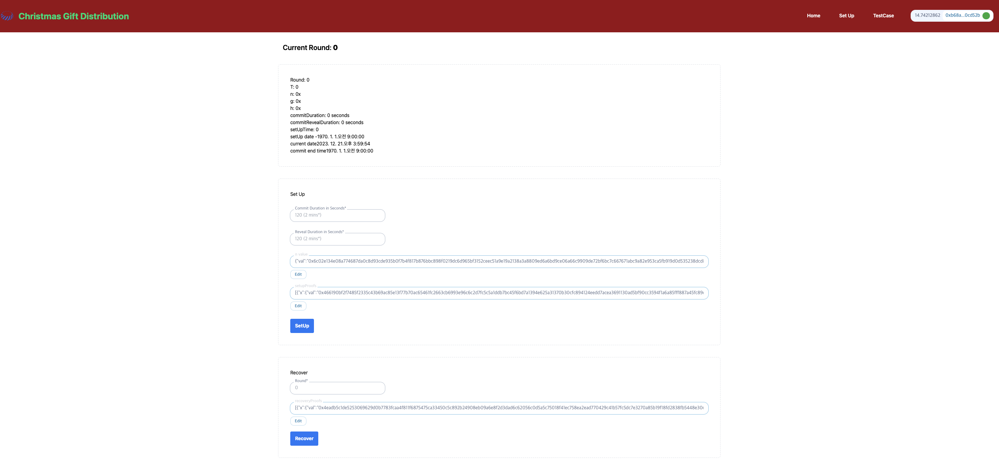

<!--
 Copyright 2023 justin
 
 Licensed under the Apache License, Version 2.0 (the "License");
 you may not use this file except in compliance with the License.
 You may obtain a copy of the License at
 
     http://www.apache.org/licenses/LICENSE-2.0
 
 Unless required by applicable law or agreed to in writing, software
 distributed under the License is distributed on an "AS IS" BASIS,
 WITHOUT WARRANTIES OR CONDITIONS OF ANY KIND, either express or implied.
 See the License for the specific language governing permissions and
 limitations under the License.
-->
# Christmas Gift Distribution Event Using Commit-Reveal-Recover Random Number Generation(RNG)
[Example App](https://raffle-bicorn-rx-front.vercel.app/)
- Currently Works on Sepolia Network





Built with using:
NextJs
web3uikit
Ethers
Tailwind
Solidity
Hardhat

# Getting Started
## Requirements

- [git](https://git-scm.com/book/en/v2/Getting-Started-Installing-Git)
  - You'll know you did it right if you can run `git --version` and you see a response like `git version x.x.x`
- [Nodejs](https://nodejs.org/en/)
  - You'll know you've installed nodejs right if you can run:
    - `node --version` and get an ouput like: `vx.x.x`
- [Yarn](https://yarnpkg.com/getting-started/install) instead of `npm`
  - You'll know you've installed yarn right if you can run:
    - `yarn --version` and get an output like: `x.x.x`
    - You might need to [install it with `npm`](https://classic.yarnpkg.com/lang/en/docs/install/) or `corepack`


## QuickStart
```
git clone https://github.com/tokamak-network/Raffle-Bicorn-RX-Front.git
cd Raffle-Bicorn-RX-Front
yarn
yarn dev
```

## Formatting in VSCode

To have VSCode extension prettier auto-format `.jsx` and `.tsx`, add the following to your settings.json file:

```
  "[typescriptreact]": {
    "editor.defaultFormatter": "esbenp.prettier-vscode"
  },
  "[javascriptreact]": {
    "editor.defaultFormatter": "esbenp.prettier-vscode"
  }
```

# Usage
1. Run your local blockchain with the lottery code

> In a different terminal / command line

```
git clone https://github.com/tokamak-network/Raffle-Bicorn-RX.git
cd Raffle-Bicorn-RX
yarn 
yarn hardhat node
```
> You can read more about how to use that repo from its [README.md](https://github.com/tokamak-network/Raffle-Bicorn-RX/blob/main/README.md)

2. Add hardhat network to your metamask/wallet

- Get the RPC_URL of your hh node (usually `http://127.0.0.1:8545/`)
- Go to your wallet and add a new network. [See instructions here.](https://metamask.zendesk.com/hc/en-us/articles/360043227612-How-to-add-a-custom-network-RPC)
  - Network Name: Hardhat-Localhost
  - New RPC URL: http://127.0.0.1:8545/
  - Chain ID: 31337
  - Currency Symbol: ETH (or GO)
  - Block Explorer URL: None

Ideally, you'd then [import one of the accounts](https://metamask.zendesk.com/hc/en-us/articles/360015489331-How-to-import-an-Account) from hardhat to your wallet/metamask. 

3. Run this code

Back in a different terminal with the code from this repo, run:

```
yarn dev
```

4. Go to UI and have fun!

Head over to your [localhost](http://localhost:3000) and play with the Christmas Gift Distribution Event!